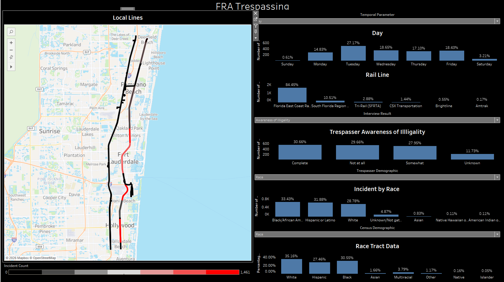

# FRA Railroad Trespassing Analysis

## Overview

This project analyzes Federal Railroad Administration (FRA) trespassing incidents across the United States using geospatial analytics, demographic data integration, and transportation safety methodologies.

The objective was to identify geographic trespassing hotspots, understand contributing factors, and provide actionable insights that could support railroad safety initiatives and public awareness efforts.

---

## Business Problem

Railroad trespassing remains one of the leading causes of rail-related fatalities and injuries in the United States.

FRA incident records contain valuable information regarding trespassing events, but these datasets are often difficult to analyze due to fragmented reporting systems, geographic complexity, and limited integration with supporting infrastructure and demographic datasets.

This project created a repeatable analytics framework that links trespassing incidents to rail infrastructure, crossing inventory data, and demographic characteristics to better understand risk patterns.

---

## Data Sources

### Federal Railroad Administration (FRA)

- Trespassers Dataset
- Trespassing Reports Dataset

### Rail Infrastructure

- North American Rail Network (NARN)
- Railroad ownership information
- Rail segment geometry

### Crossing Inventory

- FRA Grade Crossing Inventory

### Demographic Data

- United States Census Bureau
- County-level demographic information
- Population characteristics
- Education and language statistics

---

## Methodology

### Data Integration

- Merged FRA trespassing datasets
- Standardized incident records
- Cleaned railroad ownership fields
- Categorized trespassing activity types

### Geospatial Processing

- County assignment through spatial joins
- Nearest rail segment matching
- Railroad infrastructure conflation
- Crossing inventory integration

### Safety Analytics

- Incident frequency analysis
- Rail corridor hotspot identification
- County-level trend analysis
- Railroad ownership comparisons

### Demographic Analysis

- Census data integration
- Community characteristic analysis
- Geographic risk factor exploration

---

## Technologies

- Python
- Pandas
- GeoPandas
- Shapely
- NumPy
- Tableau
- GIS
- Spatial Analysis

---

## Key Results

- Processed and standardized thousands of FRA trespassing incidents
- Matched incidents to rail infrastructure nationwide
- Created railroad segment incident counts
- Integrated demographic and census information
- Developed interactive Tableau dashboards for exploration and reporting
- Produced a repeatable geospatial safety analytics workflow

---

## Dashboard

---

## Skills Demonstrated

- Geospatial Analytics
- Transportation Safety Analytics
- Data Engineering
- GIS
- Spatial Joins
- Data Visualization
- Statistical Analysis
- Python Development
- Tableau Dashboard Development

---

## Business Impact

This project transformed raw FRA trespassing records into an integrated analytics platform that enables transportation agencies, researchers, and safety professionals to identify trespassing hotspots, understand geographic risk patterns, and support data-driven safety initiatives.
