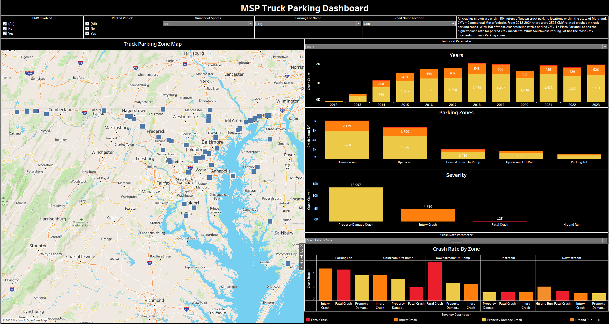

# Truck Parking Safety Analysis

## Overview

This project investigates the relationship between truck parking facilities and roadway safety using geospatial analytics, transportation data engineering, and statistical analysis.

The objective was to determine whether truck parking facilities experience different crash patterns and crash rates compared to surrounding roadway segments and control locations.

By integrating crash records, truck parking infrastructure, traffic volume data, and commercial vehicle identification techniques, this project created a repeatable framework for evaluating transportation safety near truck parking facilities.

---

## Business Problem

Truck parking shortages are a growing challenge across the United States.

Limited parking availability can contribute to unsafe parking behavior, driver fatigue, and operational inefficiencies. Understanding crash activity near truck parking facilities is critical for transportation planners and safety professionals seeking to improve freight infrastructure and roadway safety.

This project developed a geospatial analytics workflow to evaluate crash activity surrounding truck parking facilities and quantify safety impacts using traffic exposure measures.

---

## Data Sources

### Crash Data
- Maryland State Police (MSP) Crash Records
- Vehicle-Level Crash Information
- Harmful Event Records
- Crash Narratives

### Truck Parking Data
- Maryland Truck Parking Facilities
- Parking Zone Boundaries
- Parking Capacity Information

### Transportation Network Data
- Traffic Message Channel (TMC) Network
- Roadway Direction Information
- Segment Geometry

### Exposure Data
- Vehicle Miles Traveled (VMT)
- Traffic Volume Data
- Hourly Traffic Patterns

---

## Methodology

### Truck Parking Zone Development

- Cleaned and standardized truck parking facility data
- Generated parking zone classifications
- Created upstream, downstream, ramp, and parking lot zones
- Assigned facility identifiers and attributes

### Crash Conflation

- Spatially matched crashes to truck parking facilities
- Performed buffer-based proximity analysis
- Identified nearest parking zones
- Generated facility-level crash datasets

### Direction Validation

- Compared crash travel direction against facility direction
- Validated roadway alignment
- Reduced false-positive matches

### Commercial Vehicle Identification

- Vehicle body type classification
- NLP-based narrative analysis
- Commercial vehicle inference modeling
- CMV scoring and validation

### Traffic Exposure Integration

- Assigned TMC roadway segments
- Integrated Vehicle Miles Traveled (VMT)
- Calculated exposure-adjusted crash rates

### Statistical Analysis

- Crash frequency comparisons
- Crash rate calculations
- Facility versus control comparisons
- Transportation safety evaluation

---

## Technologies

- Python
- Pandas
- GeoPandas
- Shapely
- NumPy
- NLTK
- Tableau
- GIS
- Spatial Analysis

---

## Key Results

- Processed and analyzed over one million crash records
- Developed automated crash-to-facility conflation workflows
- Integrated truck parking infrastructure and traffic exposure data
- Created commercial vehicle identification models using NLP techniques
- Calculated crash rates using Vehicle Miles Traveled (VMT)
- Produced Tableau dashboards and visual analytics outputs

---

## Dashboard

---

## Skills Demonstrated

- Geospatial Analytics
- Transportation Safety Analytics
- Data Engineering
- Spatial Joins
- NLP
- Statistical Analysis
- Tableau Dashboard Development
- Python Development
- GIS

---

## Business Impact

This project transformed raw transportation datasets into a comprehensive truck parking safety analytics platform, providing insights into crash patterns, freight infrastructure performance, and potential safety risks associated with truck parking operations.
